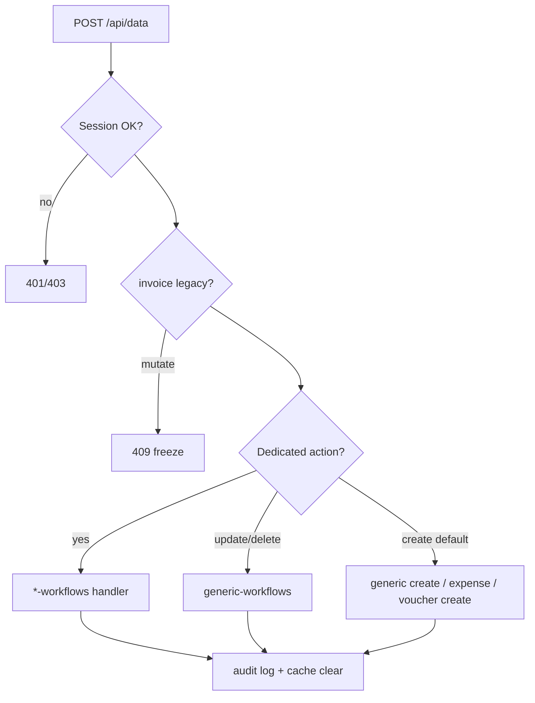

# Handoff API — `/api/data` & endpoint terkait

**Tanggal:** 2026-06-02
**Pasangan UI:** [HANDOFF.md](./HANDOFF.md) (matriks halaman) · [WORKFLOW.md](../WORKFLOW.md) (aturan bisnis)

Semua route admin CRUD/list utama melalui **`POST/GET /api/data`** (`app/src/app/api/data/route.ts`, ~1.9k baris). Handler bisnis dipecah ke `app/src/lib/api/*-workflows.ts` dan `data-query-support.ts`.

---

## 1. Kontrak umum

### GET `/api/data?entity=...`

| Query | Fungsi |
|-------|--------|
| `entity` | Wajib (kecuali invalid → 400) |
| `id` | Satu dokumen |
| `filter` | JSON string filter Supabase |
| `page`, `pageSize` | Paginasi |
| `q`, `searchFields` | Pencarian |
| `sortField`, `sortDir` | Urutan |
| `sortPreset` | Mis. `work-queue` (nota, voucher, overpayment) |
| `countOnly=1` | Hanya total |
| `dateFrom`, `dateTo` | Khusus `expenses-summary`, attendance |
| `period`, `date` | Khusus attendance / audit |
| `ids` | Khusus `customers-summary`, `vehicles-summary` (comma-separated) |
| `bankAccountRef` | Khusus `bank-transactions-summary` |
| `orFilters`, `definedFields` | Khusus `customer-overpayments` |

**Auth:** `getSession()` — tanpa sesi → 401; role `DRIVER` → 403.

**Response:** `{ data }` atau `{ data, meta: { page, pageSize, total } }`.

### POST `/api/data`

```json
{
  "entity": "orders",
  "action": "create-with-items",
  "data": { ... }
}
```

- Tanpa `action` → dianggap **create** (`isCreateAction`).
- `action: "update"` / `"delete"` → generic atau dedicated handler.
- Aksi tidak dikenal → 400.

**Side effect:** `addAuditLog` untuk mutasi penting; `clearRelationalReadCache` setelah beberapa write.

---

## 2. Pemetaan entity → modul RBAC

Sumber: `ENTITY_MODULE_MAP` di `route.ts`. Permission dicek via `hasPermission(role, module, create|update|delete)`.

| Entity URL | Modul RBAC |
|------------|------------|
| `orders`, `order-items` | `orders` |
| `delivery-orders`, `delivery-order-items`, `trip-records`, `surat-jalan-records`, … | `deliveryOrders` |
| `freight-notas`, `freight-nota-items`, `payments`, `customer-receipts`, `invoice-adjustments`, `customer-overpayment-refunds` | `freightNotas` |
| `invoices`, `invoice-items` | `freightNotas` (legacy read) |
| `driver-vouchers`, `driver-voucher-items`, `driver-voucher-disbursements` | `driverVouchers` |
| `driver-borongans`, `driver-borongan-items` | `driverBorongans` (OWNER) |
| `expenses` | `expenses` |
| `purchases`, `purchase-items`, `purchase-payments` | `purchases` |
| `warehouse-items`, `stock-movements` | `warehouseItems` |
| `bank-accounts`, `bank-transactions` | `bankAccounts` |
| `incidents`, `incident-settlement-lines`, `incident-action-logs` | `incidents` |
| `maintenances` | `maintenance` |
| `tire-events`, `tire-history-logs` | `tires` |
| `vehicles` | `vehicles` |
| `drivers`, `driver-scores` | `drivers` |
| `customers` + anak (`customer-products`, …) | `customers` |
| `trip-route-rates` | `tripRouteRates` |
| `services`, `expense-categories` | OWNER-only mutation |
| `employees`, `employee-attendance-records` | `employees` / `attendance` |
| `journal-*`, `chart-of-accounts` | `reports` |
| `users` | `userManagement` |
| `audit-logs` | `auditLogs` |
| `company` | `companySettings` (OWNER update) |

---

## 3. GET khusus (bukan CRUD dokumen biasa)

| entity | Handler / file | Modul view |
|--------|----------------|------------|
| `dashboard-summary` | `getDashboardSummary` | `dashboard` |
| `customers-summary` | `getCustomersSummary` | `customers` |
| `vehicles-summary` | `getVehiclesSummary` | `vehicles` |
| `expenses-summary` | `getExpensesSummary` (+ privacy filter non-OWNER) | `expenses` |
| `bank-accounts-summary` | `getBankAccountsSummary` | `bankAccounts` |
| `bank-transactions-summary` | agregat in/out per `bankAccountRef` | `bankAccounts` |
| `audit-logs-summary` | `getAuditLogsSummary` | `auditLogs` |
| `users-summary` | `getUsersSummary` | OWNER |
| `employee-attendance-summary` | `getEmployeeAttendanceSummary` | `attendance` |
| `employee-attendance-records` | `getEmployeeAttendanceList` (list khusus) | `attendance` |
| `driver-borongan-do-refs` | `getDriverBoronganDoRefsSummary` | `driverVouchers` create |
| `delivery-order-trip-cash-link` | `getDeliveryOrderTripCashLink` | `deliveryOrders` |
| `customer-overpayments` | `getCustomerOverpaymentList` / by id | `freightNotas` |
| `maintenance-material-options` | `getMaintenanceMaterialOptions` | `maintenance` |

### Proyeksi baca (tidak ada tabel sendiri)

`PROJECTED_READ_ENTITIES` → `getProjectedDocumentRead` (`projected-document-reads.ts`):

| entity | UI tipikal |
|--------|------------|
| `trips` | List trip |
| `surat-jalan` | List SJ |
| `surat-jalan-items` | Item per SJ |
| `trip-tracking` | Tracking |
| `trip-detail` | `TripDetailPage` |
| `trip-detail-references` | Data pendukung trip detail |
| `surat-jalan-detail` | Detail SJ |

Permission flags diteruskan ke proyeksi (edit cargo, shipper ref, dll.).

### List khusus (masih entity di `DOCUMENT_TYPE_MAP`)

| entity | Catatan GET |
|--------|-------------|
| `freight-notas` | `getFreightNotaList` + derived status |
| `freight-nota-items` | derived |
| `customer-receipts` | `getCustomerReceiptList` |
| `driver-vouchers` | `getDriverVoucherList` + ledger derived |
| `driver-borongans` | OWNER read; `getDriverBoronganList` |
| `expenses` | `getExpenseList` + privacy |
| `audit-logs` | `getAuditLogList` |
| `delivery-orders`, `orders` | derived fields di response |

---

## 4. POST — aksi dedicated (urutan dispatch)

Jika tidak cocok, jatuh ke **generic** (`handleGenericCreate/Update/Delete`) atau error.

### Order & trip (`order-workflows.ts`)

| entity | action | Handler |
|--------|--------|---------|
| `orders` | `create-with-items` | `handleOrderCreate` |
| `orders` | `update-with-items` | `handleOrderUpdateWithItems` |
| `orders` | `update-header-booking` | `handleOrderHeaderBookingUpdate` |
| `orders` | `append-trip-plan` | `handleOrderTripPlanAppend` |
| `orders` | `update-trip-plan` | `handleOrderTripPlanUpdate` |
| `orders` | `delete-trip-plan` | lokal di `route.ts` |
| `orders` | `cancel-trip-plan` | `handleOrderTripPlanCancel` |
| `orders` | `cancel-order` | `handleOrderCancel` |
| `orders` | `revise-targets` | `handleOrderTargetRevision` |
| `orders` | `delete` | `handleOrderDelete` |
| `order-items` | `set-hold-quantity` | `handleOrderItemHoldSet` |
| `order-items` | `release-hold` | `handleOrderItemHoldRelease` |
| `delivery-orders` | `create-with-items` | `handleDeliveryOrderCreate` |
| `delivery-orders` | `set-status` | `handleDeliveryOrderStatusUpdate` |
| `delivery-orders` | `set-surat-jalan-status-batch` | `handleDeliveryOrderBatchSuratJalanStatusUpdate` |
| `delivery-orders` | `cancel-trip` | `handleDeliveryOrderCancelTrip` |
| `delivery-orders` | `assign-trip-resources` | `handleDeliveryOrderTripResourceAssign` |
| `delivery-orders` | `append-cargo-items` | `handleDeliveryOrderAppendCargoItems` |
| `delivery-orders` | `update-cargo-item` | `handleDeliveryOrderCargoItemUpdate` |
| `delivery-orders` | `remove-cargo-item` | `handleDeliveryOrderCargoItemRemove` |
| `delivery-orders` | `update-shipper-reference` | `handleDeliveryOrderShipperReferenceUpdate` |
| `delivery-orders` | `update-surat-jalan-actual-cargo` | `handleDeliveryOrderSuratJalanActualCargoUpdate` |
| `delivery-orders` | `update-manual-overtonase` | `handleDeliveryOrderManualOvertonaseUpdate` |
| `delivery-orders` | `set-trip-closure` | `handleDeliveryOrderTripClosureSet` |
| `delivery-orders` | `continue-held-cargo` | `handleDeliveryOrderContinueHeldCargo` |
| `delivery-orders` | `reject-driver-status-request` | `handleDeliveryOrderDriverStatusRequestReject` |

**Role khusus (bypass modul default):** lihat `hasSpecialMutationPermission` — mis. `settle`/`top-up` voucher, `assign-trip-resources`, `stock-movements`, dll.

### Finance (`finance-workflows.ts`)

| entity | action | Handler |
|--------|--------|---------|
| `freight-notas` | `create-with-items` | `handleFreightNotaCreate` |
| `freight-notas` | `update-with-items` | `handleFreightNotaUpdate` |
| `freight-notas` | `delete` | `handleFreightNotaDelete` |
| `freight-notas` | `update-pph23` | `handleFreightNotaPph23Update` |
| `freight-notas` | `update-tax-invoice` | `handleFreightNotaTaxInvoiceUpdate` |
| `payments` | (create) | `handlePaymentCreate` |
| `payments` | `update` | `handlePaymentUpdate` |
| `customer-receipts` | (create) | `handleCustomerReceiptCreate` |
| `customer-overpayment-refunds` | (create) | `handleCustomerOverpaymentRefund` |
| `invoice-adjustments` | (create) | `handleInvoiceAdjustmentCreate` |
| `invoice-adjustments` | `update` | `handleInvoiceAdjustmentUpdate` |
| `invoice-adjustments` | `delete` | `handleInvoiceAdjustmentDelete` |
| `invoice-adjustments` | `void` | `handleInvoiceAdjustmentVoid` |
| `bank-transactions` | `transfer` | `handleBankTransfer` |
| `invoices` | `create-with-items` | `handleInvoiceCreate` (**legacy** — cek freeze) |

### Uang jalan & borongan (`driver-workflows.ts`)

| entity | action | Handler |
|--------|--------|---------|
| `driver-vouchers` | (create) | `handleDriverVoucherCreate` |
| `driver-vouchers` | `settle` | `handleDriverVoucherSettlement` |
| `driver-vouchers` | `top-up` | `handleDriverVoucherTopUp` |
| `driver-vouchers` | `repair-issue-ledger` | `handleDriverVoucherIssueRepair` |
| `driver-voucher-items` | (create) | `handleDriverVoucherItemCreate` |
| `driver-voucher-items` | `update` | `handleDriverVoucherItemUpdate` |
| `driver-voucher-items` | `delete` | `handleDriverVoucherItemDelete` |
| `driver-voucher-disbursements` | `update` | `handleDriverVoucherDisbursementUpdate` |
| `driver-voucher-disbursements` | `delete` | `handleDriverVoucherDisbursementDelete` |
| `driver-borongans` | `mark-paid` | `handleBoronganPayment` |
| `driver-borongans` | `create-with-items` | **409** — dinonaktifkan |

### Inventory (`inventory-workflows.ts`)

| entity | action | Handler |
|--------|--------|---------|
| `purchases` | `create-with-items` / create | `handlePurchaseCreate` |
| `purchases` | `receive` | `handlePurchaseReceive` |
| `purchase-payments` | `record-payment` | `handlePurchasePaymentCreate` |
| `stock-movements` | (create) | `handleStockMovementCreate` |

### Maintenance & ban (`maintenance-workflows.ts`, `generic-workflows.ts`)

| entity | action | Handler |
|--------|--------|---------|
| `maintenances` | `complete-with-materials` | `handleMaintenanceComplete` |
| `maintenances` | `record-tire-technician-cost` | `handleTireTechnicianCostCreate` |
| `tire-events` | `install-to-slot` | `handleTireInstallToSlot` |

### Insiden (`operations-workflows.ts`)

| entity | action | Handler |
|--------|--------|---------|
| `incidents` | (create) | `handleIncidentCreate` |
| `incidents` | `set-status` | `handleIncidentStatusUpdate` |
| `incident-settlement-lines` | (create) | `handleIncidentSettlementLineCreate` |
| `incident-settlement-lines` | `update` / `delete` / `set-status` | handler settlement |
| `incident-settlement-lines` | `create-tire-follow-up` | tire follow-up |
| `incident-settlement-lines` | `create-maintenance-follow-up` | maintenance follow-up |

### Akuntansi (`accounting-workflows.ts`)

| entity | action | Handler |
|--------|--------|---------|
| `journal-entries` | `create-manual` | `handleManualJournalCreate` |
| `journal-entries` | `void-manual` | `handleManualJournalVoid` |

### SDM (`driver-score-workflows.ts`)

| entity | action | Handler |
|--------|--------|---------|
| `driver-scores` | `end-early` | `handleDriverScoreEndEarly` |

### Pengeluaran

| entity | action | Handler |
|--------|--------|---------|
| `expenses` | (create) | `handleExpenseCreate` |

### Generic fallback

| entity | action | Handler |
|--------|--------|---------|
| *semua di `DOCUMENT_TYPE_MAP`* | `update` | `handleGenericUpdate` |
| *semua di `DOCUMENT_TYPE_MAP`* | `delete` | `handleGenericDelete` |
| *sisanya create* | — | `handleGenericCreate` |

Contoh generic: `customers`, `suppliers`, `vehicles`, `drivers`, `employees`, `warehouse-items`, `maintenances` (jadwal), `company`, `trip-route-rates`, dll.

---

## 5. Pembatasan penting

### Legacy invoice — dibekukan

`LEGACY_READ_ONLY_ENTITIES`: `invoices`, `invoice-items`

- **POST** mutasi → **409** dengan pesan arahkan ke Freight Nota.
- **GET** masih boleh (histori).

### OWNER-only

**Mutation:** `company`, `audit-logs`, `services`, `expense-categories`, `driver-borongans`, `driver-borongan-items`

**Read:** `audit-logs`, borongan (+ items) — non-OWNER tidak akses list.

### Users

- `users` **delete** → 409 (nonaktifkan saja).
- Non-OWNER hanya `update` profil sendiri (di route + UI settings).

### Expenses privacy

Non-OWNER: filter paksa `privacyLevel: internal` pada list/summary.

### Vehicles

Non-OWNER: field sensitif disanitize di GET (`sanitizeVehicleForRole`).

---

## 6. File handler (untuk debugging)

| File | Domain |
|------|--------|
| `order-workflows.ts` | Order, DO, trip plan, hold, SJ cargo |
| `finance-workflows.ts` | Nota, payment, receipt, adjustment, transfer |
| `driver-workflows.ts` | Voucher, borongan bayar |
| `inventory-workflows.ts` | PO, stok, bayar supplier |
| `maintenance-workflows.ts` | Selesai maintenance, biaya teknisi ban |
| `generic-workflows.ts` | CRUD generik, `install-to-slot` |
| `operations-workflows.ts` | Insiden |
| `accounting-workflows.ts` | Jurnal manual |
| `driver-score-workflows.ts` | Skor supir |
| `support-workflows.ts` | Legacy invoice create |
| `data-query-support.ts` | List/summary/query kompleks |
| `projected-document-reads.ts` | Trip/SJ proyeksi |
| `response-derivations.ts` | Enrich response order/DO/nota |
| `master-data-import.ts` | Import Excel |

---

## 7. API di luar `/api/data`

| Route | Metode | Fungsi |
|-------|--------|--------|
| `/api/auth/login` | POST | Login admin web saja (`scope: ADMIN`; akun DRIVER ditolak) |
| `/api/auth/logout` | POST | Logout admin |
| `/api/auth/session` | GET | Cek sesi |
| `/api/data-import` | POST | `preview` / `commit` master data |
| `/api/driver/session` | GET | Sesi supir |
| `/api/driver/delivery-orders` | GET | Trip assigned |
| `/api/driver/delivery-orders/status` | POST | Update status |
| `/api/driver/delivery-orders/batch-status` | POST | Batch SJ |
| `/api/driver/delivery-orders/cargo` | POST | Muatan |
| `/api/driver/delivery-orders/cargo-item` | POST | Item muatan |
| `/api/driver/delivery-orders/shipper-references` | POST | Referensi SJ |
| `/api/driver/delivery-orders/create` | POST | Buat DO (mobile) |
| `/api/driver/tracking` | POST | GPS start/stop/heartbeat |
| `/api/driver/incidents` | GET/POST | Lapor insiden |
| `/api/driver/accounts` | POST | CRUD akun supir (admin) |
| `/api/driver/logout` | POST | |
| `/api/driver/mobile/login` | POST | Token mobile |
| `/api/driver/mobile/refresh` | POST | Refresh token |
| `/api/driver/scoring/acknowledge` | POST | Ack skor |
| `/api/notifications/operational-admin/due-reminders` | — | Reminder operasional |

API driver dipakai app Flutter: [HANDOFF-MOBILE.md](./HANDOFF-MOBILE.md). Ringkasan aturan: §5.16 [HANDOFF.md](./HANDOFF.md).

---

## 8. Diagram alur dispatch POST



---

## 9. Checklist saat menambah endpoint

1. Tambah ke `DOCUMENT_TYPE_MAP` (`document-types.ts`) jika entitas baru.
2. Tambah `ENTITY_MODULE_MAP` + entri di `rbac.ts`.
3. Implement handler di workflow file yang tepat — **jangan** hanya mengandalkan generic jika ada side effect finance/DO.
4. Daftarkan action di `getMutationPermissionAction` jika bukan create/delete/update standar.
5. Pertimbangkan `hasSpecialMutationPermission` jika role lintas modul.
6. Update [HANDOFF.md](./HANDOFF.md) matriks UI + dokumen ini.
7. UAT di `docs/UAT_*.md` bila menyentuh workflow bisnis.

---

*Generated from `app/src/app/api/data/route.ts` and workflow imports — verify line numbers after large refactors.*
