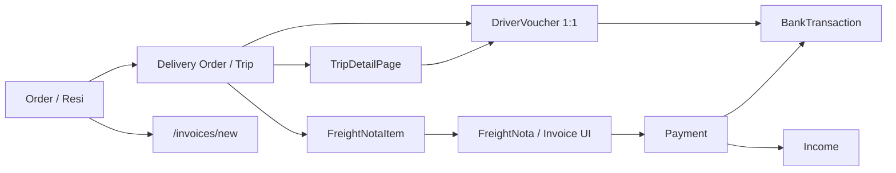

# Handoff Dokumentasi — Sistem Logistik PT Gading Mas Surya

**Tanggal:** 2026-06-02 (matriks §5.1–§5.29)
**Audience:** developer / QA / asisten AI yang melanjutkan audit atau perbaikan tanpa mengubah workflow bisnis tanpa instruksi eksplisit.
**Repo canonical:** `C:\LOGISTIK\app\` (bukan root `C:\LOGISTIK\` yang hanya scaffold Next minimal di `git ls-files`).

---

## 1. Indeks dokumen (baca berurutan)

| Prioritas | Dokumen | Isi |
|-----------|---------|-----|
| 1 | [WORKFLOW.md](../WORKFLOW.md) | Alur bisnis **sesuai kode yang jalan** — sumber kebenaran perilaku |
| 2 | [SYSTEM_MODULES_AND_WORKFLOWS.md](./SYSTEM_MODULES_AND_WORKFLOWS.md) | Modul lengkap, role, UAT, edge case commit besar |
| 3 | **Dokumen ini** | Peta halaman → API → aturan + redundansi + cleanup |
| 3b | [HANDOFF-API.md](./HANDOFF-API.md) | Indeks `GET/POST /api/data`: entity, action, workflow files, pembatasan legacy |
| 3c | [HANDOFF-MOBILE.md](./HANDOFF-MOBILE.md) | App Flutter `apps/driver_app` → `/api/driver/*` (portal web `/driver` dihapus) |
| 3d | [AUDIT-DO-TO-INVOICE-SCENARIOS.md](./AUDIT-DO-TO-INVOICE-SCENARIOS.md) | Checklist UAT read-only: multi-SJ, hold, partial, split invoice, mismatch siap-ditagih |
| 4 | [AUDIT.md](../AUDIT.md) | Brutal truth kondisi produk (billing dual, API besar, dll.) |
| 5 | UAT | [UAT_ALL_MODULES_COMPREHENSIVE.md](./UAT_ALL_MODULES_COMPREHENSIVE.md), [UAT_UANG_JALAN_TRIP_SETTLEMENT.md](./UAT_UANG_JALAN_TRIP_SETTLEMENT.md), [UAT_TIRE_MAINTENANCE.md](./UAT_TIRE_MAINTENANCE.md) |

**Jangan ubah workflow bisnis** hanya karena refactor teknis. Baca `WORKFLOW.md` + UAT modul terkait sebelum menyentuh `app/src/app/api/data/route.ts` atau workflow handler.

---

## 2. Sumber kebenaran (source of truth)

| Area | Path / entitas |
|------|----------------|
| Kode aplikasi | `app/src/` |
| API pusat | `app/src/app/api/data/route.ts` — detail action: [HANDOFF-API.md](./HANDOFF-API.md) |
| Workflow bisnis tertulis | `app/WORKFLOW.md` |
| Import master | `app/src/lib/master-data-import-config.ts` |
| RBAC & menu | `app/src/lib/rbac.ts` → `getSidebarMenu()`, `hasPageAccess()`, `hasPermission()` |
| Tagihan customer **aktif** | entitas `freightNota` — UI label **Invoice** di `/invoices` |
| Tagihan **legacy** | entitas `invoice` — histori / read-only; jangan buat dual-billing baru |
| Laba rugi | `payment` + `expense` |
| Arus kas | `bankTransaction` (+ **Kas Tunai** otomatis untuk `CASH` tanpa rekening) |
| Eksekusi pengiriman | `deliveryOrder` (+ `deliveryOrderItem`, `actualDropPoints`, `actualCargoItems`) |
| Uang jalan trip | `driverVoucher` — **1 voucher = 1 DO**; eksklusif dengan borongan pada DO yang sama |
| Ban aset | `tireEvent` (`TIRE_ASSET`), slot via `install-to-slot` |
| Proyeksi trip/SJ | `app/src/lib/projected-document-reads.ts` |

### Yang sudah dibersihkan (folder non-canonical)

Dihapus dari workspace (tidak dipakai produksi): `app-main-merge/`, `app-reseed-only/`, root `.next/`, `node_modules/`, `output/`, `.playwright-cli/`, log `.codex-start-*.`, PDF/JPEG di root.
Root `.gitignore` diperbarui agar artifact tidak menumpuk lagi.

### Istilah penting

- **Customer** = pengirim / pihak ditagih — bukan penerima barang.
- **Order / Resi** = kontrak muatan customer.
- **DO / Trip** = eksekusi per kendaraan-supir; **Surat Jalan** = proyeksi per referensi shipper di dalam DO.
- UI **Invoice** = database **`freightNota`**.

---

## 3. Navigasi & RBAC (ringkas)

Menu dari `getSidebarMenu(role)` — item difilter `hasPageAccess`.

| Role | Catatan akses halaman |
|------|------------------------|
| OWNER | Penuh |
| OPERASIONAL | Order, trip, SJ, uang jalan (kelola), pengeluaran, customer, import |
| FINANCE | **Tidak** `/orders`; invoice, kas, laporan akuntansi, settle uang jalan |
| ARMADA | **Tidak** `/orders`; fleet, maintenance, ban |
| DRIVER | Hanya app Flutter — bukan admin panel |

**Route khusus:**

| Route | Perilaku |
|-------|----------|
| `/delivery-orders/[id]` | Redirect ke trip detail (`/trips/[id]` atau setara) — komponen `TripDetailPage` |
| `/trips`, `/surat-jalan` | Proyeksi DO; detail = `TripDetailPage` |
| `/borongan` | Hanya OWNER — **tidak** di sidebar |
| `/reports` | Laba rugi & arus kas operasional |
| `/accounting/*` | Jurnal, buku besar, akun (finance) |

Permission granular: `hasPermission(role, module, action)` — contoh `freightNotas.create`, `driverVouchers.settle`, `orders.update`.

---

## 4. Indeks modul → route → entity API

| Modul UI | Route utama | Entity GET umum | Entity POST / action kunci |
|----------|-------------|-----------------|---------------------------|
| Dashboard | `/dashboard` | `dashboard-summary` | — |
| Order | `/orders`, `/orders/[id]`, `/orders/new` | `orders`, `order-items`, `delivery-orders` | `create-with-items`, `append-trip-plan`, `cancel-order`, `delete` |
| Pengeluaran | `/expenses` | `expenses`, `expenses-summary` | create |
| Kas / bank | `/bank-accounts` | `bank-accounts`, `bank-accounts-summary` | CRUD, `bank-transactions` `transfer` |
| Laporan ops | `/reports` | payments, expenses, bank-transactions, … | — (client aggregate) |
| Akuntansi | `/accounting/*` | chart-of-accounts, journal-entries, journal-lines | `create-manual`, `void-manual` |
| Borongan | `/borongan` (OWNER) | `driver-borongans` | `mark-paid`, `delete` |
| Driver mobile (Flutter) | `apps/driver_app` | `/api/driver/*` + `mobile/login` | [HANDOFF-MOBILE.md](./HANDOFF-MOBILE.md) — satu-satunya UI supir |
| Surat jalan | `/surat-jalan`, `/surat-jalan/[id]` | `surat-jalan`, `surat-jalan-detail` | subset aksi `delivery-orders` per SJ |
| Gudang | `/inventory/*` | `warehouse-items`, `purchases`, `stock-movements` | CRUD barang, `create-with-items`, `receive`, mutasi manual |
| Supplier | `/suppliers` | `suppliers` | CRUD |
| SDM | `/employees`, `/attendance` | `employees`, `employee-attendance-records` | CRUD absensi |
| Insiden | `/fleet/incidents` | `incidents`, `incident-settlement-lines` | `set-status`, settlement, expense, ban |
| Master | `/trip-rates`, `/services` | `trip-route-rates`, `services` | CRUD (services: OWNER write) |
| Settings | `/settings/*` | `company`, `users`, `audit-logs` | profil, import `/api/data-import` |
| Auth | `/login` | — | `POST /api/auth/login` |
| Penerimaan customer | `/invoices` (modal) | `customer-receipts`, `customer-overpayments` | alokasi multi-nota |
| Trip / DO | `/trips/[id]` | `trip-detail`, `trip-detail-references` | lihat §5.4 |
| Invoice (nota) | `/invoices`, `/invoices/[id]`, `/invoices/new` | `freight-notas`, `freight-nota-items`, `payments` | lihat §5.6 |
| Uang jalan | `/driver-vouchers/*` | `driver-vouchers`, items, disbursements | lihat §5.7 |
| Customer | `/customers`, `/customers/[id]` | `customers`, anak master | lihat §5.2 |
| Ban | `/fleet/tires` | `tire-events` | lihat §5.3 |

---

## 5. Matriks halaman (tampilan → data → handler → aturan)

Format: **Blok UI** | **GET** | **POST** | **Aturan workflow**

### 5.1 Dashboard — `/dashboard`

**File:** `src/app/(admin)/dashboard/page.tsx`
**Support:** `src/lib/dashboard-page-support.ts`

| Blok | GET | Catatan |
|------|-----|---------|
| KPI order, DO, invoice, maintenance, insiden | `GET /api/data?entity=dashboard-summary` | Label **Invoice** = agregat `freightNota`, bukan `invoice` legacy |
| Antrian order / nota / DO | payload `dashboard-summary` | Helper `getRecentOrderAction`, `getRecentNotaAction` |
| Pengingat borongan / bon | dihitung API | `boronganStats` ada di API — **belum ada kartu UI** di halaman (gap dokumentasi vs API) |

Refresh: sekali saat mount (abort on unmount). Tidak ada auto-refresh 15s.

---

### 5.2 Customer — `/customers`, `/customers/[id]`

**File:** `customers/page.tsx`, `customers/[id]/page.tsx`

| Blok | GET |
|------|-----|
| Daftar + ringkasan | `customers`, `customers-summary` (list) |
| Detail: info, pickup, penerima, master barang, tarif | `customers`, `customer-products`, `customer-recipients`, `customer-pickups`, `customer-billing-rates`, `services` |
| Order & nota terkait | `orders` (filter customer), `freight-notas` |

| Write | Entity | Catatan |
|-------|--------|---------|
| CRUD master customer & anak | `customers`, `customer-products`, `customer-recipients`, `customer-pickups`, `customer-billing-rates` | Handler `generic-workflows` |
| Prefix SJ customer | field `deliveryOrderPrefix` | Dipakai order/DO untuk format referensi shipper |

Customer ≠ penerima. Tarif billing per customer dipakai saat compose nota (`findMatchingCustomerBillingRate`).

---

### 5.3 Ban — `/fleet/tires` (+ tab di detail kendaraan)

**File:** `fleet/tires/page.tsx`

| Blok | GET |
|------|-----|
| Daftar aset ban | `tire-events` (resolved via `resolveFleetTireEvents`) |
| Kendaraan & stok gudang | `vehicles`, `warehouse-items` |
| Histori | `tire-history-logs` |

| Aksi | entity | action |
|------|--------|--------|
| Catat / edit ban | `tire-events` | create / `update` |
| Pasang ke slot | `tire-events` | `install-to-slot` |
| Biaya teknisi (terpisah dari finance umum) | `maintenances` | `record-tire-technician-cost` |

Aturan: slot layout dari `tire-slots`; ban gudang vs ban di unit; persentase pemakaian wajib pada skenario tertentu; finance hanya mencatat **biaya teknisi** lewat maintenance, bukan menggantikan logistik slot.

UAT: [UAT_TIRE_MAINTENANCE.md](./UAT_TIRE_MAINTENANCE.md).

---

### 5.4 Trip detail — `/trips/[id]` (alias DO)

**File:** `src/app/(admin)/_components/TripDetailPage.tsx` (~9k+ baris)
**Load:** `GET entity=trip-detail&id=` + `trip-detail-references`; refresh berkala (~15s).

| Blok UI | Fungsi |
|---------|--------|
| Kelola trip | status DO, resource, tutup trip admin |
| SJ batch | status per shipper reference, cetak |
| Muatan / aktual / POD | `actualCargoItems`, `actualDropPoints`, finalisasi |
| Tracking | lock driver/kendaraan saat ACTIVE/PAUSED |
| Overtonase / upah borongan | `taripBorongan`, manual overtonase |
| Uang jalan | terbitkan bon, top-up, biaya, settle (jika voucher ada) |
| Cetak | DO/SJ/PDF branded |

| POST utama | entity | action |
|------------|--------|--------|
| Status SJ batch | `delivery-orders` | `set-surat-jalan-status-batch` |
| Aktual muatan SJ | `delivery-orders` | `update-surat-jalan-actual-cargo` |
| Assign supir/kendaraan | `delivery-orders` | `assign-trip-resources` |
| Overtonase manual | `delivery-orders` | `update-manual-overtonase` |
| Batalkan trip | `delivery-orders` | `cancel-trip` |
| Tutup trip | `delivery-orders` | `set-trip-closure` |
| Terbitkan uang jalan | `driver-vouchers` | create (tanpa action) |
| Top-up / settle | `driver-vouchers` | `top-up`, `settle` |
| Biaya lain trip | `driver-voucher-items` | create |
| Approval driver | `delivery-orders` | `reject-driver-status-request` |

Aturan: hanya **admin** yang menetapkan `DELIVERED` + POD + aktual final; driver mengirim **pending request**. Nota memakai muatan **aktual** setelah final. Uang jalan: 1 bon per DO.

---

### 5.5 Order detail — `/orders/[id]`

**File:** `orders/[id]/page.tsx` (~3700 baris)

| GET (inti) | Filter / catatan |
|------------|------------------|
| `orders?id=` | header |
| `order-items` | `orderRef` |
| `delivery-orders` | `orderRef` + query busy assignment |
| `delivery-order-items`, `freight-nota-items` | per DO order |
| `freight-notas` | dari nota item |
| Referensi modal | `customers`, `services`, `customer-products`, `customer-pickups`, `vehicles`, `drivers`, `bank-accounts`, `trip-route-rates` |

| Blok UI | Isi |
|---------|-----|
| Progress muatan | target / aktual / rencana — `buildOrderDetailMetrics` |
| Informasi order | customer, layanan, pickup |
| Rencana trip | `order.tripPlans[]` — armada, supir, uang jalan awal, upah |
| Item / koli atau manifest per SJ | mode item vs **header-only** order |
| Trip / DO internal | link ke trip detail |
| Invoice ongkos | nota terkait |

| POST | entity | action | Aturan singkat |
|------|--------|--------|----------------|
| Rencana trip | `orders` | `append-trip-plan` / `update-trip-plan` | Wajib pickup, kendaraan, supir, `issueBankRef`, `cashGiven`, `taripBorongan` |
| Hapus rencana | `orders` | `delete-trip-plan` | Hanya jika belum punya SJ |
| Buat SJ | `delivery-orders` | `create-with-items` | Dari sisa item atau muatan langsung; bisa pakai `orderTripPlanKey` |
| Hold item | `order-items` | `set-hold-quantity` / `release-hold` | Partial per qty/berat/volume |
| Batalkan trip | `delivery-orders` atau `orders` | `cancel-trip` / `cancel-trip-plan` | Blok jika sudah final cargo / pending driver |
| Batalkan order | `orders` | `cancel-order` | Blok jika ada DO aktif, nota, atau progress terkirim |
| Buat invoice | navigasi | `/invoices/new` | Aktif jika `billableDeliveredDoCount > 0` (`DELIVERED` + `hasDeliveryOrderBillableCargo`) |

RBAC: `orders.update` untuk trip/hold/batal; `freightNotas.create` untuk tombol invoice.

---

### 5.6 Invoice / Nota — `/invoices`, `/invoices/[id]`, `/invoices/new`

**Entitas:** `freightNotas` (UI: Invoice).

#### Daftar — `invoices/page.tsx`

| GET | Catatan |
|-----|---------|
| `freight-notas` | `sortPreset=work-queue`, filter periode/status/q |
| `payments`, `customers`, `customer-overpayments` | status piutang & alokasi |

#### Detail — `invoices/[id]/page.tsx`

| GET | |
|-----|---|
| `freight-notas`, `freight-nota-items`, `payments`, `invoice-adjustments`, `bank-accounts` | |

| Blok | |
|------|---|
| Detail invoice | bruto, net, PPh 23, collie, berat final |
| Kartu piutang | transfer final, dibayar, sisa / kelebihan |
| Riwayat pembayaran | `payments` |
| Klaim / potongan | `invoice-adjustments` |
| Rincian perjalanan | baris nota per DO/SJ |

| POST | entity | action |
|------|--------|--------|
| Pembayaran | `payments` | create/update |
| PPh 23 | `freight-notas` | `update-pph23` |
| Faktur pajak | `freight-notas` | `update-tax-invoice` |
| Potongan | `invoice-adjustments` | CRUD |
| Refund kelebihan | `customer-overpayment-refunds` | default POST |
| Hapus | `freight-notas` | `delete` |
| Revisi | navigasi | `/invoices/new?edit=` |

Guard UI: revisi/hapus/PPh 23 diblok jika sudah ada pembayaran, refund, atau potongan aktif (`canReviseInvoice`, `canDeleteInvoiceSafely`).

#### Buat / revisi — `invoices/new/page.tsx`

| POST | `freight-notas` | `create-with-items` / `update-with-items` |
|------|-----------------|------------------------------------------|
| Sumber baris | DO `DELIVERED` + muatan billable; tarif dari `customer-billing-rates` | |

---

### 5.7 Uang jalan trip — `/driver-vouchers/*`

**Label:** Bon / Uang Jalan Trip. **1 voucher = 1 DO.**

#### Daftar — `driver-vouchers/page.tsx`

`GET driver-vouchers` (paginated, `sortPreset=work-queue`).

#### Detail — `driver-vouchers/[id]/page.tsx`

| GET | |
|-----|---|
| `driver-vouchers`, `driver-voucher-items`, `driver-voucher-disbursements`, `delivery-orders` (linked) | |

| KPI | Sumber |
|-----|--------|
| Total diberikan | disbursements INITIAL + TOP_UP |
| Biaya lain-lain | items |
| Upah borongan | voucher + DO (`taripBorongan`, overtonase) |
| Saldo penyelesaian | `buildDriverVoucherSettlementDisplay` |

| POST | entity | action | Role UI |
|------|--------|--------|---------|
| Biaya lain | `driver-voucher-items` | CRUD | OWNER, OPERASIONAL |
| Top-up | `driver-vouchers` | `top-up` | OWNER, OPERASIONAL |
| Edit/hapus top-up | `driver-voucher-disbursements` | update/delete | OWNER, OPERASIONAL |
| Selesaikan | `driver-vouchers` | `settle` | OWNER, FINANCE |
| Rekonsiliasi pencairan lama | `driver-vouchers` | `repair-issue-ledger` | OWNER, FINANCE |
| Overtonase manual | `delivery-orders` | `update-manual-overtonase` | OWNER/OPS, DO belum ditutup admin |

Banner kuning: voucher tanpa `issueBankRef` → wajib `repair-issue-ledger` agar mutasi kas konsisten.

#### Terbitkan — `driver-vouchers/new/page.tsx`

`POST driver-vouchers` dengan `deliveryOrderRef`, `cashGiven`, `issueBankRef`.
DO yang sudah punya voucher atau masuk `driver-borongan-do-refs` tidak bisa dipilih.

**Jalur paralel:** semua aksi di atas juga tersedia dari `TripDetailPage` (terbitkan, top-up, settle, biaya).

UAT: [UAT_UANG_JALAN_TRIP_SETTLEMENT.md](./UAT_UANG_JALAN_TRIP_SETTLEMENT.md).

---

### 5.8 Order list — `/orders`

**File:** `orders/page.tsx`

| Blok | Isi |
|------|-----|
| KPI / antrian | `queueCounts`: perlu dispatch, in progress, on hold |
| Tabel | Resi, customer, status, layanan, progress, **status bon trip** per order |
| Filter | Status, kategori armada (`services`), pencarian, sort tanggal |

| GET | Catatan |
|-----|---------|
| `orders` | Paginated, `sortPreset=work-queue` atau sort `createdAt` |
| `services` | Filter kategori |
| `delivery-orders` | Per halaman — `orderRef` ∈ order IDs |
| `driver-vouchers` | Per DO — untuk meta bon (`NEEDS_BON`, `BON_DRAFT`, dll.) |

| POST | entity | action | Aturan |
|------|--------|--------|--------|
| Hapus order | `orders` | `delete` | Hanya order tanpa dampak (konfirmasi modal); backend menolak jika sudah ada DO/nota |

**RBAC:** modul `orders` — FINANCE/ARMADA **tidak** punya akses halaman.
**Next action UI:** `getNextActionLabel` + `getTripCashStatusMeta` (mis. “Terbitkan bon trip”, “Lanjutkan sisa pengiriman”).

---

### 5.9 Order baru — `/orders/new`

**File:** `orders/new/page.tsx`

| Blok UI | Isi |
|---------|-----|
| Customer / Pengirim | Pilih customer, cek **limit kredit** (`summarizeCustomerCreditUsage`) |
| Titik Pickup Order | Multi pickup (`PickupStopForm`), master `customer-pickups` |
| Assign Trip di Order | Satu atau lebih **trip draft** (armada, supir, rute, upah, uang jalan awal) |

| GET (form) | |
|------------|---|
| `customers`, `services`, `vehicles` (ACTIVE/IN_SERVICE), `drivers`, `bank-accounts`, `trip-route-rates`, `delivery-orders` + `orders` OPEN/PARTIAL (busy lock) | |
| Saat customer dipilih | `customer-pickups`, `freight-notas` (untuk kredit) | |

| POST | entity | action | Catatan |
|------|--------|--------|---------|
| Simpan order | `orders` | `create-with-items` | Payload: `items: []`, `tripDrafts[]`, `pickupStops[]` — muatan bisa menyusul via SJ (header-only style) |

Aturan: trip draft sama validasinya dengan `append-trip-plan` di detail order (pickup, kendaraan, supir, `issueBankRef`, `cashGiven`, `taripBorongan`, override armada).

---

### 5.10 Pengeluaran — `/expenses`

**File:** `expenses/page.tsx`
**Tidak ada route `/payments` terpisah** — pembayaran customer ada di `/invoices/[id]` (`payments` entity).

| Blok | Isi |
|------|-----|
| Ringkasan | `expenses-summary`: grand total, rata-rata, per kategori |
| Tabel | Transaksi + link referensi (voucher, borongan, insiden, maintenance) |
| Filter | Kategori, rekening, periode, privacy (`internal` vs owner-only) |

| GET | |
|-----|---|
| `expenses` (paginated), `expenses-summary`, `expense-categories`, `bank-accounts`, `vehicles` (non-FINANCE) | |
| Referensi baris | `driver-vouchers`, `driver-borongans`, `incidents`, `maintenances` (via helper `fetchExpenseReferences`) | |

| POST | entity | action |
|------|--------|--------|
| Pengeluaran manual | `expenses` | default create (`categoryName`, optional `bankAccountRef`) |

**RBAC:** `expenses.create` untuk tombol tambah. Non-OWNER hanya lihat `privacyLevel: internal`.
**Laba rugi:** expense masuk agregat P&L di `/reports` tab **Laba Rugi**.

---

### 5.11 Rekening & Kas — `/bank-accounts`

**File:** `bank-accounts/page.tsx`
**Support:** `bank-account-page-support.ts`

| Blok | Isi |
|------|-----|
| Daftar rekening/kas | Saldo, tipe BANK vs CASH (Kas Tunai sistem) |
| Ringkasan | `bank-accounts-summary`: total saldo, kas vs bank |
| Transfer antar rekening | Modal transfer |
| Cetak / Excel | Daftar rekening |

| GET | |
|-----|---|
| `bank-accounts` (paginated), `bank-accounts-summary`, `company` (rekening tercantum di invoice) | |

| POST | entity | action |
|------|--------|--------|
| Tambah rekening | `bank-accounts` | create |
| Edit | `bank-accounts` | `update` |
| Hapus | `bank-accounts` | `delete` |
| Transfer | `bank-transactions` | `transfer` |

**RBAC:** `bankAccounts` create/update/delete/export/print per role.
Sumber kebenaran saldo untuk arus kas; pembayaran tunai tanpa pilihan rekening → **Kas Tunai** otomatis (`WORKFLOW.md`).

---

### 5.12 Laporan operasional — `/reports`

**File:** `reports/page.tsx`
**Support:** `reports-support.ts` — agregasi client-side dari koleksi penuh.

| Tab | Sumber data | Metrik utama |
|-----|-------------|--------------|
| **Laba Rugi** (`pnl`) | `payments`, `customer-overpayment-refunds`, `expenses`, `purchases`, `freight-notas` (info tagihan) | Revenue, expense, net profit; outstanding nota; **bukan** jurnal akuntansi |
| **Arus Kas** (`cashflow`) | `bank-transactions`, `bank-accounts` | Mutasi per rekening, saldo, link sumber (`bank-transaction-links`) |

| GET (sekali load) | |
|-------------------|---|
| Semua koleksi di atas + `company` | |

Tidak ada POST — export Excel/print dari snapshot periode (bulan/custom).
**Bedanya dengan §5.13:** `/reports` = operasional owner (payment + expense + bank tx); **bukan** neraca/jurnal double-entry.

---

### 5.13 Laporan akuntansi — `/accounting/*`

#### Laporan Keuangan — `accounting/statements/page.tsx`

| Tab | Perhitungan | GET |
|-----|-------------|-----|
| Laba rugi (ledger) | `buildProfitLossFromLedger` | `chart-of-accounts`, `journal-entries`, `journal-lines`, `company` |
| Neraca | `buildBalanceSheetFromLedger` | sama |

Filter periode: bulan / custom (`finance-period`). Hanya **baca** + cetak.

#### Jurnal Umum — `accounting/journals/page.tsx`

| GET | |
|-----|---|
| `journal-entries` (paginated + filter periode/status), `journal-lines`, `chart-of-accounts` | |

| POST | entity | action |
|------|--------|--------|
| Jurnal manual | `journal-entries` | `create-manual` |
| Batalkan jurnal manual | `journal-entries` | `void-manual` |

#### Buku Besar — `accounting/ledger/page.tsx`

| GET | Tampilan saldo per akun dari `journal-lines` + `chart-of-accounts` |

#### Akun Perkiraan — `accounting/accounts/page.tsx`

Master `chart-of-accounts` (CRUD sesuai permission `reports` / finance).

---

### 5.14 Armada — kendaraan, supir, maintenance

#### Kendaraan list — `/fleet/vehicles`

| GET | `vehicles` (paginated), `services`, `vehicles-summary` (ringkasan ban per unit) |
| KPI | Siap dipakai, ban belum lengkap, perlu cek status |
| Navigasi | `/fleet/vehicles/new`, `/fleet/vehicles/[id]` |

#### Kendaraan baru — `/fleet/vehicles/new`

| POST | `vehicles` | create (kapasitas, `serviceRef`, plat, status) |

#### Kendaraan detail — `/fleet/vehicles/[id]`

| Blok | GET |
|------|-----|
| Info unit | `vehicles?id=` |
| Maintenance, insiden, trip | `maintenances`, `incidents`, `delivery-orders` |
| Ban di unit | `tire-events`, `tire-history-logs`, `expenses` (biaya ban) |
| Tab pasang/ganti ban | Sama §5.3: `install-to-slot` + `record-tire-technician-cost` |

#### Supir list — `/fleet/drivers`

| GET | `drivers` |
| POST | `drivers` create/update, toggle `active` |
| Akun login driver | `POST /api/driver/accounts` (bukan `/api/data`) — create/update kredensial mobile |

#### Supir detail — `/fleet/drivers/[id]`

| GET | `drivers`, `delivery-orders`, `driver-vouchers` (riwayat) — read-only ringkasan |

#### Maintenance — `/fleet/maintenance`

| GET | `maintenances` (paginated), `vehicles`, `maintenance-material-options`, `bank-accounts`, `tire-events` |
| POST | `maintenances` | create (`SCHEDULED`) |
| | `maintenances` | `update` (skip → `SKIPPED`) |
| | `maintenances` | `complete-with-materials` (stok gudang + labor) |
| | `tire-events` | `install-to-slot` (maintenance ban — `maintenanceRef` di payload) |

**RBAC:** modul `vehicles`, `drivers`, `maintenance` — dominan **ARMADA** + OWNER.

---

### 5.15 Slip borongan — `/borongan` (OWNER only)

**RBAC:** `driverBorongans` — `hasPageAccess` hanya **OWNER**; role lain di-redirect ke `/driver-vouchers`. **Tidak** ada di sidebar.

| Route | Perilaku |
|-------|----------|
| `/borongan` | Daftar `driver-borongans` (filter periode/status, sort `periodStart`) |
| `/borongan/[id]` | Detail + baris `driver-borongan-items` |
| `/borongan/new` | **Redirect** ke `/driver-vouchers/new` — workflow aktif = uang jalan trip |

| POST (detail) | entity | action |
|---------------|--------|--------|
| Tandai dibayar | `driver-borongans` | `mark-paid` (metode, rekening, tanggal) |
| Hapus slip | `driver-borongans` | `delete` |

Arsip historis untuk trip yang **tidak** disettle lewat uang jalan; eksklusif dengan voucher/borongan DO (`driver-borongan-do-refs`).

---

### 5.16 Driver (mobile + API) — portal web `/driver` dihapus

UI supir hanya **Flutter** (`apps/driver_app`). Backend tetap `app/src/app/api/driver/*` — detail layar: [HANDOFF-MOBILE.md](./HANDOFF-MOBILE.md), indeks route: [HANDOFF-API.md §7](./HANDOFF-API.md#7-api-di-luar-apidata).

| Aturan (vs admin) | |
|-------------------|---|
| Perubahan menunggu **pending approval** admin — tidak menimpa aktual final |
| Tracking **ACTIVE/PAUSED** mengunci resource trip |
| Final POD + `DELIVERED` + aktual final → **admin** di `TripDetailPage` |

Types & handler: `lib/api/driver-portal.ts`.

---

### 5.17 Surat Jalan — `/surat-jalan`, `/surat-jalan/[id]`

**Proyeksi dokumen** dari `deliveryOrder` + `shipperReferences` (`projected-document-reads` / `trip-document-types`). Bukan entitas tabel terpisah — `_id` SJ biasanya composite (trip + referensi).

#### Daftar — `surat-jalan/page.tsx`

| GET | `entity=surat-jalan` — koleksi penuh, sort `tripDate`; filter status & search **client-side** |
| Tampilan | No. SJ, trip, resi, customer, penerima, muatan ringkas, status trip |
| Navigasi | `/surat-jalan/[id]` — “Lihat Dokumen” |

#### Detail SJ — `surat-jalan/[id]/page.tsx` (~2,5k baris)

Subset **Trip detail** per satu shipper reference:

| GET | |
|-----|---|
| `surat-jalan-detail?id=` | snapshot DO + SJ + item terkait |
| `delivery-order-items`, `order-items`, `customer-products` | muatan & master barang |

| POST (inti) | entity | action |
|-------------|--------|--------|
| Status SJ / trip terkait | `delivery-orders` | `set-surat-jalan-status-batch` |
| Edit referensi SJ | `delivery-orders` | `update-shipper-reference` |
| Muatan SJ | `delivery-orders` | `append-cargo-items`, `update-cargo-item`, `remove-cargo-item` |
| Aktual drop (jika UI aktif) | `delivery-orders` | pola sama trip detail (`update-surat-jalan-actual-cargo`, dll.) |

**RBAC:** modul `deliveryOrders` (sama trip). Link ke order hanya jika `hasPageAccess('orders')`.
**Bedanya §5.4:** trip detail = seluruh DO; halaman ini = **satu SJ** dalam DO multi-referensi.

---

### 5.18 Gudang & pembelian

#### Hub — `/inventory`

Dashboard ringkas: agregat dari `warehouse-items`, `purchases`, `maintenances` (material usage), link ke submodul. Tidak ada POST.

#### Barang gudang — `/inventory/items`, `/inventory/items/[id]`

| GET | `warehouse-items` (paginated), `suppliers`; detail + `stock-movements`, `purchase-items`, `tire-events` (jika `TIRE_ASSET`) |
| Blok | Kode, nama, satuan, min stok, `trackingMode` (`STOCK` vs `TIRE_ASSET`), supplier default |

| POST | entity | action |
|------|--------|--------|
| CRUD barang | `warehouse-items` | create / `update` / toggle `active` |
| Mutasi manual | `stock-movements` | create (`MANUAL_IN` / `MANUAL_OUT`) |

Aturan: barang **`TIRE_ASSET`** — mutasi manual in/out **dinonaktifkan** di UI (stok via pembelian terima + pasang ban).

#### Pembelian — `/inventory/purchases`, `/new`, `/[id]`

| GET list | `purchases` (paginated, sort `orderDate`) |
| GET detail | `purchases`, `purchase-items`, `purchase-payments`, `stock-movements`, `tire-events` (ban dari PO), `suppliers`, `bank-accounts` |

| POST | entity | action |
|------|--------|--------|
| Buat PO | `purchases` | `create-with-items` |
| Terima barang | `purchases` | `receive` → `stock-movements` + stok |
| Bayar supplier | `purchase-payments` | `record-payment` → `expense`/kas |

**RBAC:** `purchases` — FINANCE boleh **update** + bayar; OPERASIONAL/OWNER buat PO. Masuk **expense** & laporan pembelian di `/reports`.

#### Laporan stok — `/inventory/stock-recap`

| GET | `warehouse-items`, `stock-movements` — rekapitulasi periode, cetak/Excel |
| POST | — |

#### Pemakaian material — `/inventory/material-usage`

| GET | `maintenances` (status `DONE`), `vehicles`, `warehouse-items` — analisis pemakaian dari maintenance selesai (client aggregate) |

---

### 5.19 Supplier — `/suppliers`, `/suppliers/[id]`

| GET list | `suppliers` (paginated), count aktif/nonaktif |
| GET detail | `suppliers`, `purchases`, `purchase-payments`, `warehouse-items` (default supplier), `purchase-items` |

| POST | entity | action |
|------|--------|--------|
| CRUD | `suppliers` | create / `update` / toggle `active` |

**RBAC:** OWNER + OPERASIONAL penuh; FINANCE view/export.

---

### 5.20 SDM — `/employees`, `/attendance`

#### Karyawan — `employees/page.tsx`

| GET | `employees` (paginated), count total & nonaktif |
| POST | `employees` create / `update` / `delete` |

**RBAC:** OWNER + OPERASIONAL; FINANCE view only.

#### Absensi — `attendance/page.tsx`

| GET | `employees`, `employee-attendance-records` (`period=today` atau bulanan), `employee-attendance-summary` |
| Blok | Grid harian / rekap periode, edit kehadiran per karyawan |

| POST | entity | action |
|------|--------|--------|
| Koreksi absensi | `employee-attendance-records` | create / `update` |

**RBAC:** OWNER + OPERASIONAL; FINANCE view + export.

---

### 5.21 Insiden armada — `/fleet/incidents`, `/fleet/incidents/[id]`

#### List

| GET | `incidents` (paginated), `vehicles`, `delivery-orders`, `incident-settlement-lines` (ringkasan biaya) |
| POST | `incidents` | create (unit, DO terkait, jenis, kronologi) |

#### Detail — alur settlement

| GET | `incidents`, `incident-action-logs`, `incident-settlement-lines`, `expense-categories`, `bank-accounts`, `warehouse-items`, `vehicles`, `tire-events` |

| POST | entity | action | Catatan |
|------|--------|--------|---------|
| Ubah status insiden | `incidents` | `set-status` | Butuh `revision` + catatan |
| Baris biaya / recovery | `incident-settlement-lines` | CRUD, `set-status` | DRAFT → APPROVED → POSTED |
| Post ke pengeluaran | `expenses` | create | `relatedIncidentRef`, route COMPANY vs lain |
| Follow-up ban | `incident-settlement-lines` | `create-tire-follow-up` + `tire-events` `install-to-slot` | |
| Follow-up maintenance | `incident-settlement-lines` | `create-maintenance-follow-up` | |

**RBAC:** ARMADA + OWNER penuh; OPERASIONAL bisa create/update insiden. Permission silang: `expenses.create`, `tires.*`, `maintenance.create`.

---

### 5.22 Master data operasional

#### Biaya rute trip — `/trip-rates`

| GET | `trip-route-rates` (filter aktif/nonaktif), `services` |
| POST | `trip-route-rates` | create / `update` / `delete` |

Dipakai order/trip untuk auto-match `taripBorongan` (`findMatchingTripRouteRate`).

#### Jenis armada — `/services`

| GET | `services` (paginated) |
| POST | `services` | create / `update` / `delete` |

**RBAC:** hanya **OWNER** yang boleh tambah/edit/hapus; OPERASIONAL/ARMADA view. Terhubung kapasitas kendaraan & filter order.

#### Kategori biaya — `/expense-categories`

(Referensi untuk pengeluaran & insiden — halaman terpisah di master sidebar jika ada route; entity `expense-categories`.)

---

### 5.23 Pengaturan — `/settings/*`

| Route | GET | POST |
|-------|-----|------|
| `/settings/profile` | user session | `users` `update` (nama, password sendiri) |
| `/settings/company` | `company`, `bank-accounts` | `company` — profil, logo, **rekening tercantum di invoice** |
| `/settings/users` | `users`, `users-summary` | `users` CRUD / toggle `active` — **OWNER only** (`userManagement`) |
| `/settings/import-data` | — | `POST /api/data-import` — `preview` / `commit`; target dari `master-data-import-config.ts` |
| `/settings/audit-logs` | `audit-logs`, `audit-logs-summary` | — (read-only) |
| `/settings/password` | — | ubah password (via `users` update) |

**RBAC:** `companySettings` → OWNER update; `dataImports` → OWNER + OPERASIONAL; `auditLogs` → OWNER view/export.

Import master: tidak lewat `entity=` generik — dedicated API agar validasi batch & audit terpisah.

---

### 5.24 Form & edit (halaman turunan)

Halaman satu tujuan — tidak duplikasi logik trip/finance, hanya wrapper form.

| Route | GET | POST | Catatan |
|-------|-----|------|---------|
| `/customers/new` | — | `customers` create | Prefix SJ, limit kredit, NPWP |
| `/customers` (list) | `customers`, `customers-summary` | `customers` CRUD / `delete` | Modal edit di list; KPI katalog/prefix |
| `/orders/new` | lihat §5.9 | `orders` `create-with-items` | |
| `/orders/[id]/edit` | `orders`, `order-items`, `delivery-orders`, master customer | `orders` + action: | |
| | | `update-with-items` | Belum ada DO |
| | | `update-header-booking` | Sudah ada DO — hanya header/catatan |
| | | `revise-targets` | Revisi target qty/berat/volume + `revisionReason` |
| | | `customer-pickups` create | Opsional simpan pickup ke master |
| `/expenses/new` | `expense-categories`, `bank-accounts` | `expenses` create | Duplikat modal di `/expenses` |
| `/inventory/purchases/new` | suppliers, warehouse-items | `purchases` `create-with-items` | §5.18 |

**Aturan edit order:** jika `delivery-orders` untuk order sudah ada, field header terkunci — hanya catatan (sesuai tooltip di detail order).

---

### 5.25 Invoice list — penerimaan & kelebihan bayar

Melengkapi §5.6 (detail nota). **File:** `invoices/page.tsx`.

| Blok tambahan | GET / POST |
|---------------|------------|
| KPI piutang | `freight-notas`, `payments`, filter periode |
| Antrian nota | `sortPreset=work-queue` |
| **Penerimaan customer** (multi-nota) | `POST customer-receipts` — `totalAmount`, `allocations[]` per `invoiceRef`; sisa → `customer-overpayments` |
| Daftar overpayment terbuka | `customer-overpayments` |
| Refund overpayment | `customer-overpayment-refunds` (sama pola detail nota §5.6) |

Satu transfer customer bisa dialokasikan ke beberapa nota sekaligus; kelebihan tidak hilang — tersimpan sebagai overpayment `OPEN`.

---

### 5.26 Route alias & komponen bersama

| Route | Implementasi |
|-------|----------------|
| `/trips/[id]` | `TripDetailPage` — §5.4 |
| `/delivery-orders/[id]` | **Komponen sama** `TripDetailPage` (legacy URL) |
| `/delivery-orders` | `redirect('/trips')` |
| `/` (root) | Server redirect: session admin → `/dashboard`, else `/login` |
| `/borongan/new` | Redirect → `/driver-vouchers/new` |

Jangan dokumentasikan `/delivery-orders/[id]` dan `/trips/[id]` sebagai dua sistem berbeda.

---

### 5.27 Master & armada (tambahan)

#### Kategori biaya — `/expense-categories`

| GET | `expense-categories` (paginated), count nonaktif |
| POST | create / `update` / `delete` |
| **RBAC** | OWNER penuh; OPERASIONAL & FINANCE view |

Dipakai form pengeluaran, insiden, cancel-trip expense. Kategori “manual only” vs sistem dibedakan di backend (expenses page filter `manualCategories`).

#### Skor / skors supir — `/fleet/drivers/skors`

| GET | `drivers`, `driver-scores` |
| POST | `driver-scores` create / `update` / `end-early` / `delete` |

Modul evaluasi kinerja supir (terpisah dari akun login driver).

#### Detail ban — `/fleet/tires/[id]`

| GET | `tire-events`, `tire-history-logs`, `vehicles`, `warehouse-items` |
| POST | `tire-events` `update` (data aset, % pemakaian) |

Pasang slot tetap di list ban / maintenance / insiden — §5.3.

#### Akun perkiraan — `/accounting/accounts`

| GET | `chart-of-accounts` — **read-only** di UI (search kode/nama/tipe) |
| POST | — (perubahan COA via seed/migrasi, bukan form admin saat ini) |

#### Detail rekening — `/bank-accounts/[id]`

| GET | `bank-accounts`, `bank-transactions` (paginated), `bank-transactions-summary` |
| Relasi baris mutasi | Resolve link ke `payments`, `expenses`, `purchases`, nota, voucher (`bank-transaction-links`) |
| POST | — (transfer tetap dari list `/bank-accounts`) |

---

### 5.28 Auth & sesi

| Route | API | Perilaku |
|-------|-----|----------|
| `/login` | `POST /api/auth/login` — body `{ email, password, scope: 'ADMIN' }` | Sukses → `/dashboard`; akun `DRIVER` ditolak (pakai app mobile) |
| `/driver`, `/driver/login` | *(dihapus)* | Proxy redirect ke `/login`, cookie sesi web driver dibersihkan |
| Admin layout | Session check → redirect `/login` jika tidak ada sesi | `getSession()` server di root |
| Logout admin | (dari layout) | Hapus cookie sesi |

Auth **bukan** `entity=` di `/api/data`. Jangan campur dengan CRUD bisnis.

---

### 5.29 Peta cepat: semua route admin `(admin)/`

Referensi file `page.tsx` — gunakan §5.x untuk detail API.

| Grup | Route |
|------|--------|
| Inti | `dashboard`, `orders`, `orders/new`, `orders/[id]`, `orders/[id]/edit`, `trips/[id]`, `surat-jalan`, `surat-jalan/[id]`, `delivery-orders`, `delivery-orders/[id]` |
| Tagihan & kas | `invoices`, `invoices/new`, `invoices/[id]`, `driver-vouchers`, `driver-vouchers/new`, `driver-vouchers/[id]`, `expenses`, `expenses/new`, `bank-accounts`, `bank-accounts/[id]`, `reports`, `borongan`, `borongan/[id]` |
| Gudang | `inventory`, `inventory/items`, `inventory/items/[id]`, `inventory/purchases`, `inventory/purchases/new`, `inventory/purchases/[id]`, `inventory/stock-recap`, `inventory/material-usage` |
| Master | `customers`, `customers/new`, `customers/[id]`, `suppliers`, `suppliers/[id]`, `trip-rates`, `services`, `expense-categories` |
| Armada | `fleet/vehicles`, `fleet/vehicles/new`, `fleet/vehicles/[id]`, `fleet/vehicles/[id]/edit`, `fleet/drivers`, `fleet/drivers/[id]`, `fleet/drivers/skors`, `fleet/maintenance`, `fleet/tires`, `fleet/tires/[id]`, `fleet/incidents`, `fleet/incidents/[id]` |
| SDM | `employees`, `attendance` |
| Akuntansi | `accounting/statements`, `accounting/journals`, `accounting/ledger`, `accounting/accounts` |
| Settings | `settings/profile`, `settings/password`, `settings/company`, `settings/users`, `settings/import-data`, `settings/audit-logs` |

**Driver:** tidak ada route halaman web — §5.16 + [HANDOFF-MOBILE.md](./HANDOFF-MOBILE.md).

---

## 6. Diagram hubungan modul inti



---

## 7. Temuan redundansi & risiko maintenance

**Prinsip audit:** laporkan dulu; jangan refactor workflow tanpa permintaan.

| Tingkat | Temuan | Rekomendasi (belum dilakukan) |
|---------|--------|-------------------------------|
| Tinggi | Dual billing `invoice` legacy vs `freightNota` | Pertahankan write freeze legacy; migrasi/histori — keputusan bisnis |
| Tinggi | API pusat monolit `api/data/route.ts` | Pecah per domain hanya jika ada budget maintenance |
| Sedang | `reseed:supabase` ≡ `reseed:supabase:trip-surat-jalan` di `package.json` | Hapus alias duplikat |
| Sedang | `normalizeCustomerDoPrefix` (atau serupa) di >1 file API — perilaku bisa beda | Satukan helper |
| Sedang | Logika voucher/receivable di `utils.ts` vs `*-workflow-support.ts` | Satu sumber per domain |
| Sedang | `parseStrictNumericInput` copy-paste di beberapa form | Ekstrak ke satu helper |
| Rendah | `src/lib/mockData.ts` (jika ada) tidak diimpor produksi | Hapus atau pindah ke test |
| Info | File UI sangat besar (`TripDetailPage`, `orders/[id]`, `invoices/new`) | Pecah komponen tanpa ubah kontrak API |

**Cleanup folder** (sudah): clone `app-main-merge`, `app-reseed-only`, artifact root — lihat §2.

---

## 8. Di luar scope dokumentasi matriks

| Topik | Rujukan |
|-------|---------|
| Entity `invoice` legacy | Read-only / histori — `AUDIT.md`, jangan alur aktif |
| Flutter driver | `app/apps/driver_app/` — [HANDOFF-MOBILE.md](./HANDOFF-MOBILE.md); API sama §5.16 |
| Skrip seed & migrasi Supabase | `README.md`, `package.json` scripts |
| Test Playwright / E2E | Folder `.playwright-cli` di root (artifact, bukan spec produk) |

Matriks halaman admin: **§5.1–§5.29** + indeks route **§5.29**.

---

## 9. Perintah dev & seed (referensi cepat)

```bash
cd app
npm run dev
npm run lint
npm run build
npm run reseed:supabase   # alias identik reseed:supabase:trip-surat-jalan
```

Profil demo & akun: lihat [README.md](../README.md).

---

## 10. Checklist untuk asisten berikutnya

- [ ] Baca `WORKFLOW.md` untuk area yang akan disentuh.
- [ ] Cek UAT modul di `docs/UAT_*.md`.
- [ ] Verifikasi RBAC di `rbac.ts` sebelum menambah route.
- [ ] UI label **Invoice** → entity `freightNotas`.
- [ ] Jangan mengaktifkan write `invoice` legacy.
- [ ] Uang jalan: jangan buat 2 voucher untuk 1 DO.
- [ ] Nota: gunakan muatan aktual DO, bukan rencana saja.
- [ ] Setelah perubahan finance, cek dampak **laba rugi** dan **arus kas** terpisah.

---

*Dokumen ini dibuat dari audit read-only percakapan 2026-05—06. Perbarui tanggal dan commit acuan saat ada perubahan besar di `main`.*
